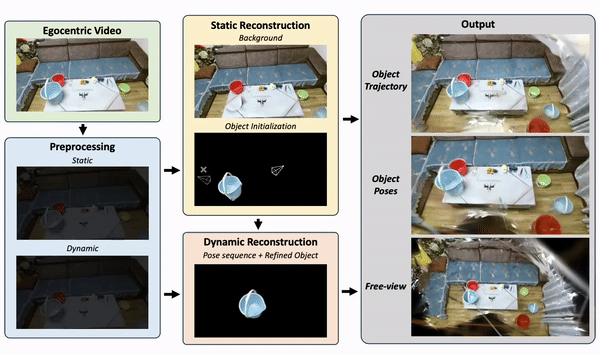

<p align="center">
  <h2 align="center">EgoGaussian: Dynamic Scene Understanding from Egocentric Video with 3D Gaussian Splatting</h2>
  <h5 align="center">International Conference on 3D Vision (3DV) 2025</h5>
</p>

<div align="center"> 

[Project Page](https://zdwww.github.io/egogs.github.io/) | [Paper](https://arxiv.org/abs/2406.19811) | [Video](https://www.youtube.com/watch?v=nsZrmM7CJB0) | [Data](https://drive.google.com/file/d/1VCC71f7YYeCahQlSNpJ0BsR1995W6jDI/view?usp=sharing)

  
</div>

## 📝 TODO List
- \[x\] Release 3DGS-ready egocentric data we processed from [EPIC-KITCHENS](https://epic-kitchens.github.io/2024), [HOI4D](https://hoi4d.github.io), and [EPIC Fields](https://epic-kitchens.github.io/epic-fields/). Please also consider citing their great works if you use this subset 🤗
- \[ \] Release code of EgoGaussian (hopefully this November)

## Citation
If you find our paper useful, please cite us:
```bib
@misc{zhang2024egogaussiandynamicsceneunderstanding,
      title={EgoGaussian: Dynamic Scene Understanding from Egocentric Video with 3D Gaussian Splatting}, 
      author={Daiwei Zhang and Gengyan Li and Jiajie Li and Mickaël Bressieux and Otmar Hilliges and Marc Pollefeys and Luc Van Gool and Xi Wang},
      year={2024},
      eprint={2406.19811},
      archivePrefix={arXiv},
      primaryClass={cs.CV},
      url={https://arxiv.org/abs/2406.19811}, 
}